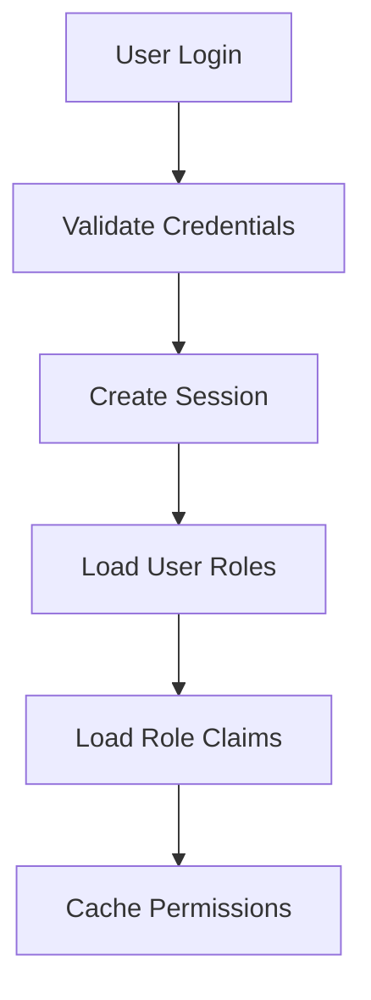

# Auth System Guide

[[Home]] > [[Database.Auth Schema]] > Auth System Guide

## Overview
The Glasgow authentication and authorization system implements a flexible, claim-based access control model. This system allows fine-grained control over user permissions through a combination of roles, claims, and access levels.

## Core Concepts

### Access Levels
The system uses five access levels to define what actions a user can perform:

| Level | Name      | Capabilities                                  | Example Use Case |
|-------|-----------|----------------------------------------------|-----------------|
| 0     | None      | No access, element hidden                     | Hidden menu items for unauthorized users |
| 1     | View      | Read-only access, can view but not modify     | Viewing inventory counts |
| 2     | Edit      | Can modify existing records                   | Updating order details |
| 3     | Delete    | Full access (create, read, update, delete)    | Managing user accounts |
| 4     | SuperUser | Advanced features and administrative access   | System configuration |

### Claims
Claims represent specific permissions for features or actions in the system. They follow a hierarchical naming pattern:

```
{type}:{feature}
```

Examples:
- `page:inventory`
- `button:create-order`
- `menu:reports`
- `feature:batch-processing`

### Roles
Roles are collections of claims with specific access levels. Each role can have different access levels for different claims.

Example Role Configuration:
```
WAREHOUSE_SUPERVISOR:
- page:inventory (Level 4) - Full inventory management
- menu:reports (Level 1) - View-only access to reports
- feature:batch-processing (Level 2) - Can modify but not create batches

INVENTORY_CLERK:
- page:inventory (Level 2) - Can update inventory
- menu:reports (Level 1) - View-only access to reports
- feature:batch-processing (Level 0) - No access
```

## How It Works

### 1. User Authentication Flow


### 2. Permission Resolution
When a user attempts to access a feature:

1. **User → Role Mapping**
   - System looks up user's assigned roles
   - Multiple roles are supported

2. **Role → Claim Mapping**
   - For each role, system retrieves associated claims
   - Each claim has a specific access level for that role

3. **Access Level Resolution**
   - If multiple roles grant the same claim, highest access level wins
   - Example: If Role A grants Level 1 and Role B grants Level 2, user gets Level 2

### 3. Security Implementation

#### Frontend Security
```typescript
// Example frontend check
interface ClaimCheck {
  claim: string;
  requiredLevel: number;
}

// Component visibility
<Button 
  visible={hasClaimLevel('button:create-order', 3)}
  onClick={createOrder}
>
  Create Order
</Button>

// Menu rendering
<MenuItem 
  visible={hasClaimLevel('menu:inventory', 1)}
>
  Inventory
</MenuItem>
```

#### Backend Security
```csharp
// Example backend validation
[RequireClaim("page:inventory", 2)]
public async Task<IActionResult> UpdateInventory(InventoryUpdate update)
{
    // Only executes if user has Level 2 or higher for page:inventory
    ...
}
```

## Best Practices

### 1. Claim Design
- Use consistent naming patterns
- Keep claims granular but not too fragmented
- Document claim purposes and requirements

### 2. Role Configuration
- Start with least privilege
- Create roles based on job functions
- Regularly audit role-claim mappings

### 3. Security Implementation
- Always implement backend validation
- Use frontend checks for UX
- Cache permission checks when appropriate
- Regularly audit access patterns

### 4. Access Level Assignment
- Use minimum required level
- Document level requirements
- Consider business impact

## Example Scenarios

### Inventory Management
```
Role: INVENTORY_MANAGER
Claims:
- page:inventory (Level 3)
- button:adjust-stock (Level 3)
- menu:reports (Level 1)
- feature:cycle-count (Level 2)

Results:
- Can create/edit/delete inventory records
- Can perform stock adjustments
- Can view inventory reports
- Can update cycle counts but not create new ones
```

### Order Processing
```
Role: ORDER_PROCESSOR
Claims:
- page:orders (Level 2)
- button:create-order (Level 0)
- menu:order-history (Level 1)
- feature:batch-processing (Level 1)

Results:
- Can modify existing orders
- Cannot create new orders
- Can view order history
- Can view batch processing status
```

## Related Pages
- [[Auth Schema]] - Database structure
- [[Auth Default Data]] - Default roles and claims
- [[Database Conventions]] - Naming standards 